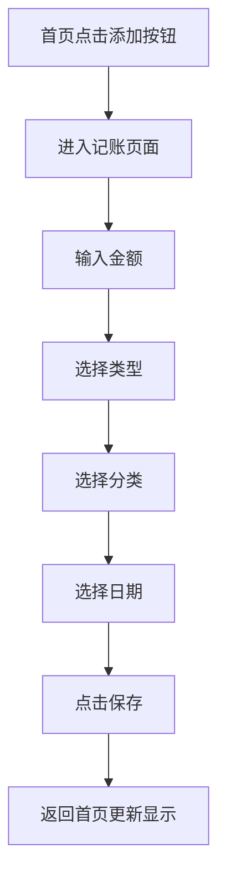
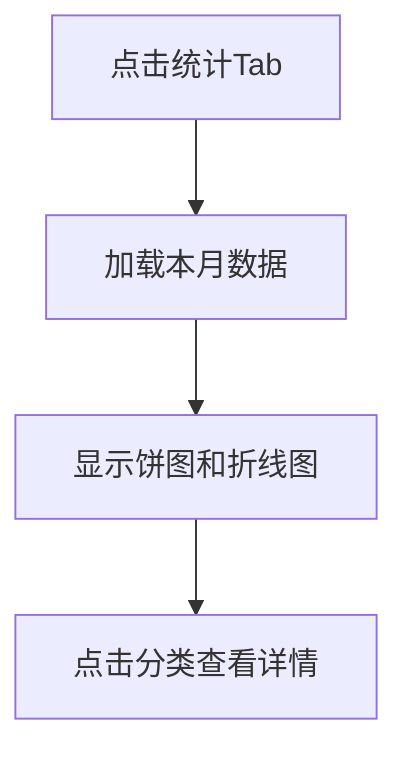

# 记账本 - 产品需求文档

## 1. 产品概述

一款简洁优雅的个人记账应用，帮助用户轻松记录日常收支，清晰了解财务状况。

- **核心目的**：快速记录收入/支出，分类管理，查看消费趋势
- **目标用户**：个人用户，需要简单易用的记账工具
- **产品价值**：帮助用户养成记账习惯，掌握个人财务

## 2. 核心功能

### 2.1 用户角色
| 角色 | 注册方式 | 核心权限 |
|------|----------|----------|
| 访客 | 无需注册 | 仅能浏览演示数据 |
| 用户 | 手机号+验证码登录 | 完整的记账功能 |

### 2.2 功能模块

1. **首页/仪表盘**
   - 本月收支概览（总收入、总支出、结余）
   - 最近交易记录列表（最近10条）
   - 快速记账入口

2. **记账页面**
   - 金额输入（大数字键盘）
   - 类型选择（收入/支出）
   - 分类选择（餐饮、交通、购物、居住、娱乐、医疗、其他）
   - 日期选择
   - 备注输入
   - 保存/删除操作

3. **统计页面**
   - 本月支出分类饼图
   - 近7天支出趋势折线图
   - 分类统计列表

4. **我的/设置页面**
   - 用户信息
   - 退出登录

## 3. 核心流程

### 3.1 快速记账流程

### 3.2 查看统计流程

## 4. 用户界面设计

### 4.1 设计风格
- **风格定位**：简约现代，带有温暖感的生活化设计
- **主色调**：#4F46E5（靛蓝紫）- 代表专业和信任
- **辅助色**：
  - 收入：#10B981（翠绿）
  - 支出：#EF4444（正红）
  - 背景：#F9FAFB（浅灰白）
- **字体**：Noto Sans SC（中文），数字使用 DIN Alternate
- **布局**：底部 Tab 导航，三个主页面
- **图标风格**：线性图标，圆润风格

### 4.2 页面设计

| 页面 | 模块 | UI 元素 |
|------|------|---------|
| 首页 | 收支概览卡片 | 圆角卡片，阴影，金额大字显示 |
| 首页 | 快速记账按钮 | 浮动按钮，渐变背景 |
| 首页 | 交易列表 | 时间分组，卡片式布局 |
| 记账页 | 金额显示 | 顶部大数字，居中 |
| 记账页 | 类型切换 | 收入/支出 Tab 切换 |
| 记账页 | 分类网格 | 3x3 图标网格，选择高亮 |
| 记账页 | 数字键盘 | 底部自定义键盘 |
| 统计页 | 饼图 | 环形图，分类颜色 |
| 统计页 | 折线图 | 7天趋势，渐变填充 |
| 我的页 | 用户卡片 | 头像、昵称、退出按钮 |

### 4.3 响应式设计
- 移动端优先设计
- 最大宽度 480px 居中显示
- 触摸友好的按钮尺寸（最小 44px）
