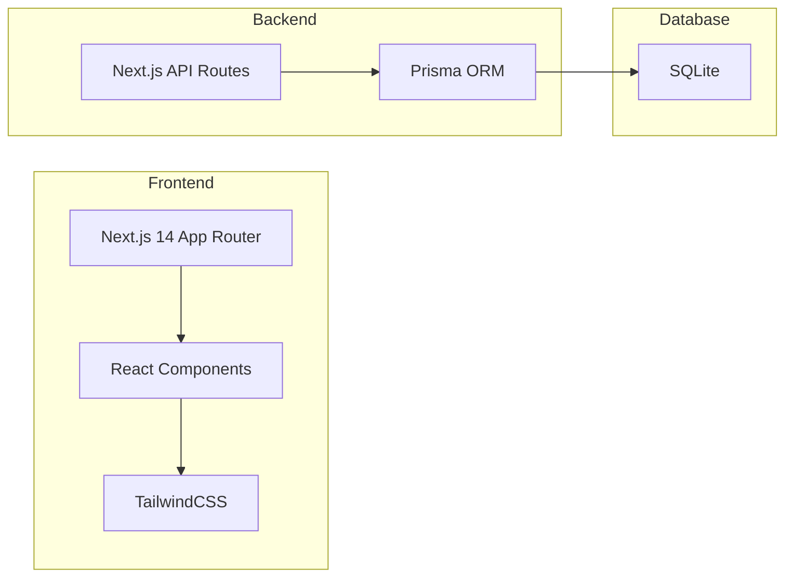
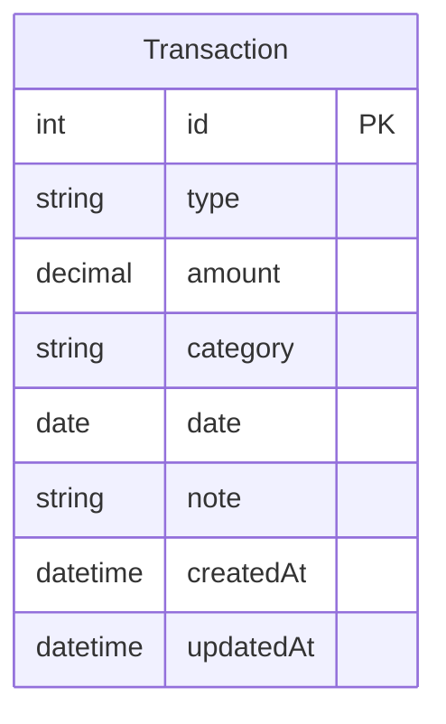

# 记账本 - 技术架构文档

## 1. 架构设计



## 2. 技术栈

- **前端框架**：Next.js 14 (App Router)
- **UI 库**：React 18 + TailwindCSS 3
- **图表库**：Recharts
- **数据库**：SQLite (轻量级，适合个人应用)
- **ORM**：Prisma
- **状态管理**：React Context + useReducer
- **日期处理**：dayjs

## 3. 路由定义

| 路由 | 页面 | 功能 |
|------|------|------|
| `/` | 首页/仪表盘 | 收支概览、最近交易 |
| `/add` | 记账页面 | 新增交易记录 |
| `/edit/[id]` | 编辑页面 | 编辑已有记录 |
| `/stats` | 统计页面 | 图表分析 |
| `/mine` | 我的页面 | 个人设置 |

## 4. API 定义

### 4.1 交易记录 API

| 方法 | 路径 | 功能 |
|------|------|------|
| GET | `/api/transactions` | 获取交易列表 |
| GET | `/api/transactions/[id]` | 获取单条记录 |
| POST | `/api/transactions` | 创建交易记录 |
| PUT | `/api/transactions/[id]` | 更新交易记录 |
| DELETE | `/api/transactions/[id]` | 删除交易记录 |
| GET | `/api/transactions/stats` | 获取统计数据 |

### 4.2 请求/响应格式

**创建交易记录 POST /api/transactions**
```typescript
// Request
{
  type: "income" | "expense",
  amount: number,
  category: string,
  date: string, // ISO date
  note?: string
}

// Response
{
  success: boolean,
  data: Transaction
}
```

## 5. 数据模型

### 5.1 ER 图



### 5.2 DDL 语句

```sql
CREATE TABLE Transaction (
    id INTEGER PRIMARY KEY AUTOINCREMENT,
    type TEXT NOT NULL CHECK(type IN ('income', 'expense')),
    amount DECIMAL(10, 2) NOT NULL,
    category TEXT NOT NULL,
    date TEXT NOT NULL,
    note TEXT,
    createdAt DATETIME DEFAULT CURRENT_TIMESTAMP,
    updatedAt DATETIME DEFAULT CURRENT_TIMESTAMP
);

CREATE INDEX idx_transaction_date ON Transaction(date);
CREATE INDEX idx_transaction_type ON Transaction(type);
```

## 6. 项目结构

```
count_notebook/
├── prisma/
│   └── schema.prisma
├── src/
│   ├── app/
│   │   ├── layout.tsx
│   │   ├── page.tsx          # 首页
│   │   ├── add/page.tsx      # 记账页
│   │   ├── edit/[id]/page.tsx # 编辑页
│   │   ├── stats/page.tsx    # 统计页
│   │   ├── mine/page.tsx     # 我的页
│   │   └── api/
│   │       └── transactions/
│   │           ├── route.ts
│   │           └── [id]/route.ts
│   ├── components/
│   │   ├── Header.tsx
│   │   ├── TabBar.tsx
│   │   ├── TransactionItem.tsx
│   │   ├── CategoryIcon.tsx
│   │   ├── AmountInput.tsx
│   │   ├── StatsPieChart.tsx
│   │   └── StatsLineChart.tsx
│   ├── lib/
│   │   ├── prisma.ts
│   │   └── categories.ts
│   └── styles/
│       └── globals.css
├── public/
├── prisma/schema.prisma
├── tailwind.config.ts
├── next.config.js
└── package.json
```

## 7. 分类定义

| 分类 | 图标 | 颜色 |
|------|------|------|
| 餐饮 | 🍜 | #F59E0B |
| 交通 | 🚗 | #3B82F6 |
| 购物 | 🛒 | #EC4899 |
| 居住 | 🏠 | #8B5CF6 |
| 娱乐 | 🎮 | #10B981 |
| 医疗 | 💊 | #EF4444 |
| 工资 | 💰 | #4F46E5 |
| 其他 | 📦 | #6B7280 |
